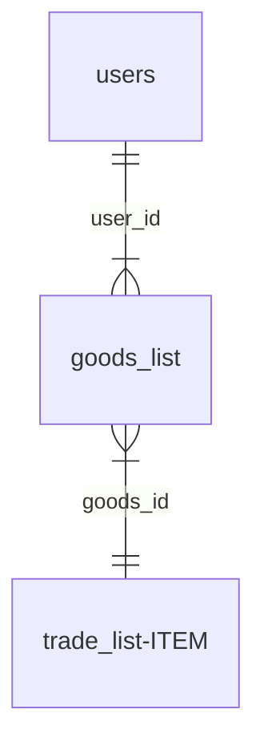

# Учебная cms

*Учебный проект*, цель которого было создание небольшого cms сайта.

Задачи:
- [X] Создание регистрации/автоизации нового пользователя
- [X] Витрина с доступным товаром/покупка товара
- [X] Личный кабинет с иcторией покупок
- [ ] Админ панель с возможностью редактирование товара

Скриншоты некоторых страниц:
- Главная страница


- Профиль


- Товары:


Структура SQL таблиц:



SQL код:
```
  База данных: `cms_test`

  CREATE TABLE `trade_list` (
    `trade_id` int NOT NULL,
    `user_id` int NOT NULL,
    `goods_id` int NOT NULL,
    `goods_value` int NOT NULL,
    `trade_costs` int NOT NULL,
    `trade_date` datetime NOT NULL
  )

  CREATE TABLE `users` (
    `user_id` int NOT NULL,
    `user_login` tinytext NOT NULL,
    `user_pass` text NOT NULL,
    `user_balance` int NOT NULL,
    `user_data_reg` datetime NOT NULL,
    `user_status` text NOT NULL
  )

  CREATE TABLE `goods_list` (
    `goods_id` int NOT NULL,
    `goods_num` text CHARACTER SET utf8mb4 COLLATE utf8mb4_ru_0900_ai_ci NOT NULL,
    `goods_name` text CHARACTER SET utf8mb4 COLLATE utf8mb4_ru_0900_ai_ci NOT NULL,
    `goods_cost` int NOT NULL,
    `goods_value` int NOT NULL
  )
  
  ALTER TABLE `trade_list`
    ADD CONSTRAINT `trade_list_ibfk_1` FOREIGN KEY (`user_id`) REFERENCES `users` (`user_id`) ON DELETE RESTRICT ON UPDATE RESTRICT,
    ADD CONSTRAINT `trade_list_ibfk_2` FOREIGN KEY (`goods_id`) REFERENCES `goods_list` (`goods_id`) ON DELETE RESTRICT ON UPDATE RESTRICT;
  COMMIT;
```
